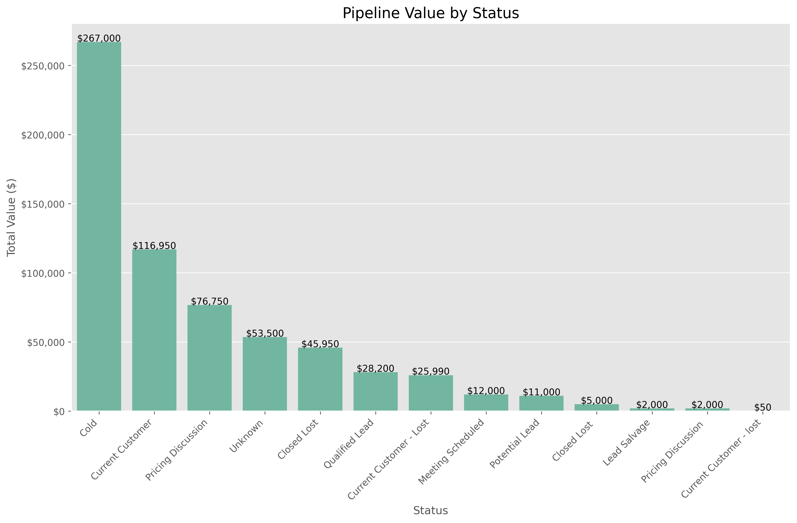
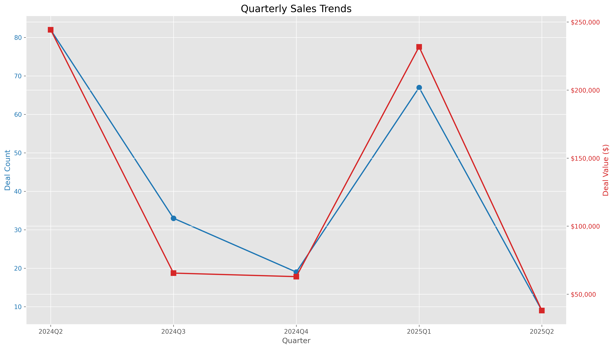
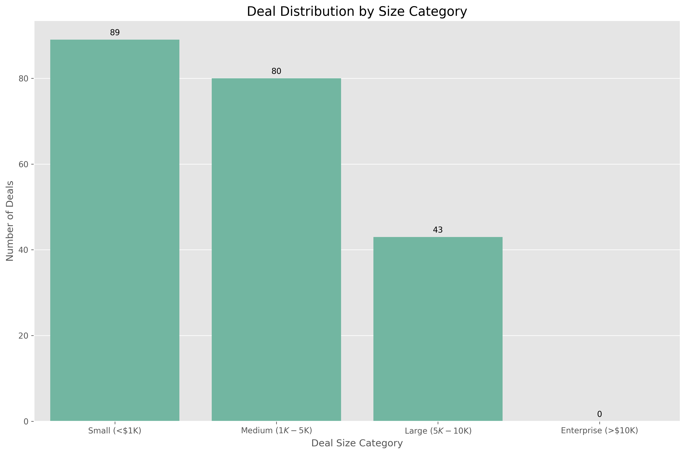
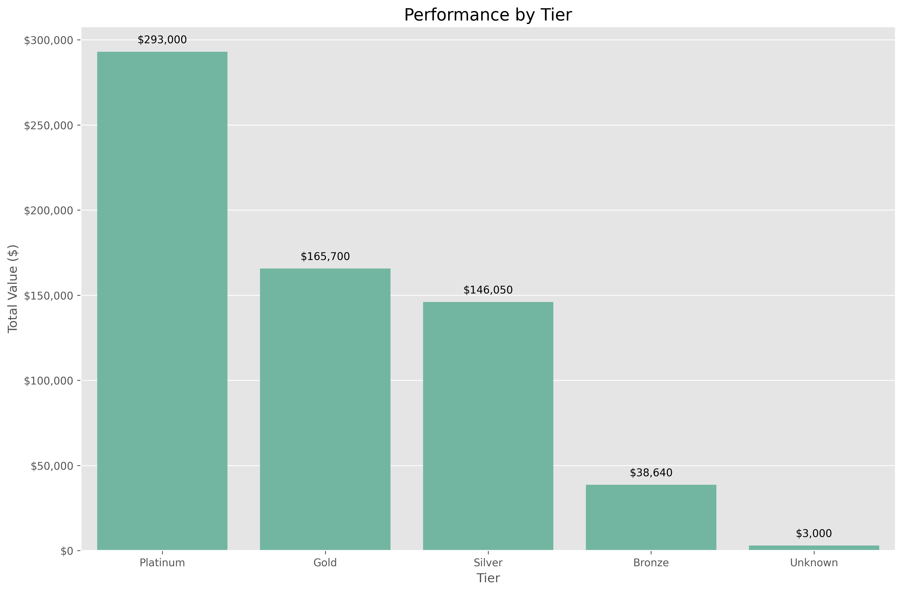

# Sales Pipeline Performance Presentation

## Executive Summary

- **Total Pipeline Value**: $646,390.00
- **Average Deal Size**: $3,049.01
- **Win/Loss Ratio**: 0.00 (0 won, 14 lost)
- **Deal Status**: Majority in early stages (Cold, Current Customer)

## Pipeline Overview

### Status Distribution

**Key Insights**:
- **Cold Stage**: 98 deals, $267,000.00
- **Current Customer**: 32 deals, $116,950.00
- **Pricing Discussion**: 18 deals, $76,750.00
- **Unknown**: 18 deals, $53,500.00
- **Closed Lost**: 14 deals, $45,950.00

### Pipeline Value by Stage

- Early-stage deals represent the largest portion of our pipeline
- No deals have been won in the current period
- Significant value ($267,000.00) remains in the Cold stage

## Sales Performance Analysis

### By Deal Lead

**Top Deal Leads**:
- **John Allen**: 
  - Total Value: $543,590.00
  - Represents 84% of total pipeline value
- **Unknown**: 
  - Total Value: $102,800.00
  - Represents 16% of total pipeline value

### By Lead Source

**Top Lead Sources by Value**:
1. **Fulfill**: $226,190.00 (77 deals)
2. **Matt Ratner**: $176,000.00 (36 deals)
3. **Internal**: $123,350.00 (58 deals)
4. **3Peel**: $72,450.00 (23 deals)
5. **Mike Hornigold**: $25,500.00 (6 deals)

## Time-based Trends

### Quarterly Performance

**Quarterly Highlights**:
- **2024 Q2**: 82 deals, $244,240.00
- **2025 Q1**: 67 deals, $231,750.00
- **2024 Q3**: 33 deals, $65,500.00
- **2024 Q4**: 19 deals, $62,900.00
- **2025 Q2**: 9 deals, $38,000.00

**Trend Analysis**:
- Strong performance in Q2 2024 and Q1 2025
- Significant drop in Q3 and Q4 2024
- Early Q2 2025 showing lower numbers (potentially incomplete quarter)

## Segment Analysis

### By Deal Size

**Deal Size Breakdown**:
- **Large ($5K-$10K)**: $401,000.00 (43 deals)
- **Medium ($1K-$5K)**: $190,800.00 (80 deals)
- **Small (<$1K)**: $54,590.00 (89 deals)
- **Enterprise (>$10K)**: $0.00 (0 deals)

**Key Insight**: While large deals represent only 20% of the deal count, they account for 62% of the total pipeline value.

### By Tier

**Tier Performance**:
- **Platinum**: $293,000.00 (32 deals, avg. $9,156.25)
- **Gold**: $165,700.00 (32 deals, avg. $5,178.12)
- **Silver**: $146,050.00 (77 deals, avg. $1,896.75)
- **Bronze**: $38,640.00 (68 deals, avg. $568.24)
- **Unknown**: $3,000.00 (3 deals, avg. $1,000.00)

## Key Insights and Recommendations

### Key Insights
- **Pipeline Health**: Substantial pipeline value ($646,390.00) but concentrated in early stages
- **Conversion Challenge**: 0% win rate with 14 lost deals indicates conversion issues
- **Lead Source Effectiveness**: Fulfill, Matt Ratner, and Internal sources driving highest value
- **Deal Lead Concentration**: Heavy reliance on John Allen (84% of pipeline value)
- **Deal Size Strategy**: Large deals ($5K-$10K) drive the majority of pipeline value

### Recommendations

1. **Improve Conversion Rates**:
   - Implement structured follow-up process for Cold stage deals
   - Analyze lost deals to identify common failure points

2. **Diversify Deal Lead Portfolio**:
   - Reduce dependency on John Allen by developing additional sales talent
   - Create training program based on John Allen's successful approaches

3. **Optimize Lead Sources**:
   - Increase investment in top-performing sources (Fulfill, Matt Ratner)
   - Evaluate cost-effectiveness of lower-performing sources

4. **Focus on High-Value Segments**:
   - Prioritize Platinum and Gold tier opportunities
   - Develop strategies to convert more Medium deals to Large category

5. **Address Quarterly Fluctuations**:
   - Implement consistent pipeline building activities to smooth quarterly performance
   - Investigate factors behind strong Q2 2024 and Q1 2025 performance